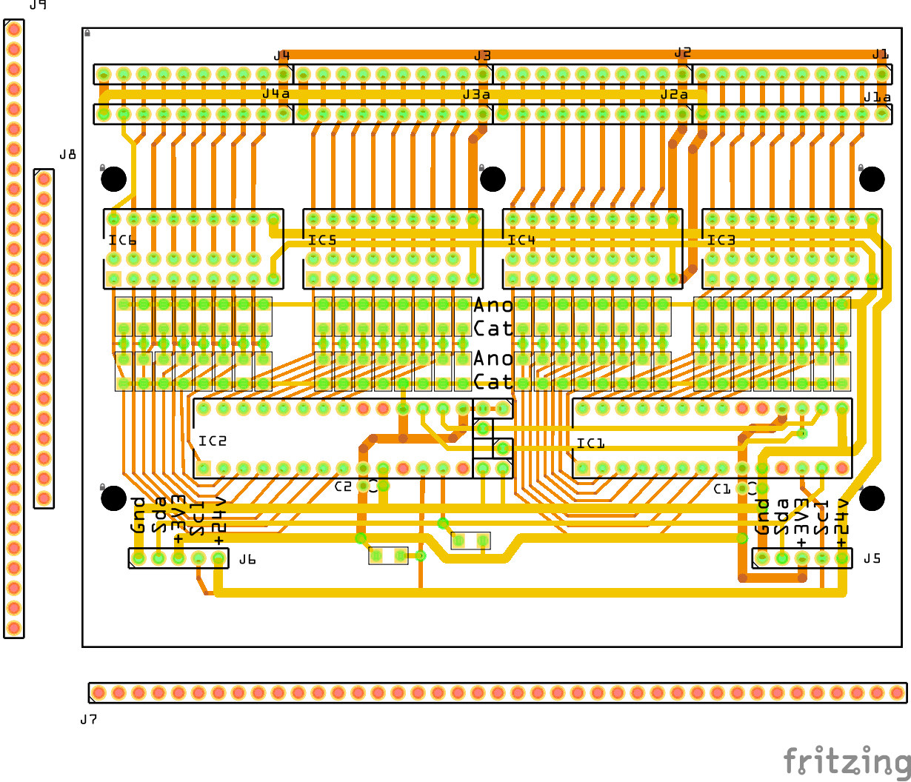
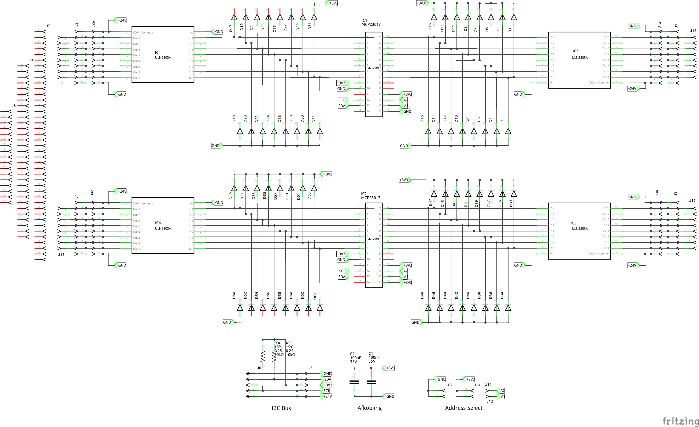

# IHC-Replacement

Her laver jeg en erstatning for mit LK IHC system

Jeg kan ikke længere få reserve dele til mit IHC system som styrer alt lys i huset. 
Jeg har i forevejen et Home Assistant project igang, så nu vil jeg fremstille PCB som kan virke som interface mellem min El installation Og Home Assistant.

## Fritzing

* [PCB Input/Output](./InputBoard/Input_Board_020.fzz)
  * 
  * 

## FreeCAD

* [DINBox ](./FreeCAD/DINBox_002.FCStd)
  * [Images](./FreeCAD/Images/Skærmbillede%20fra%202024-12-03%2021-47-26.png)
