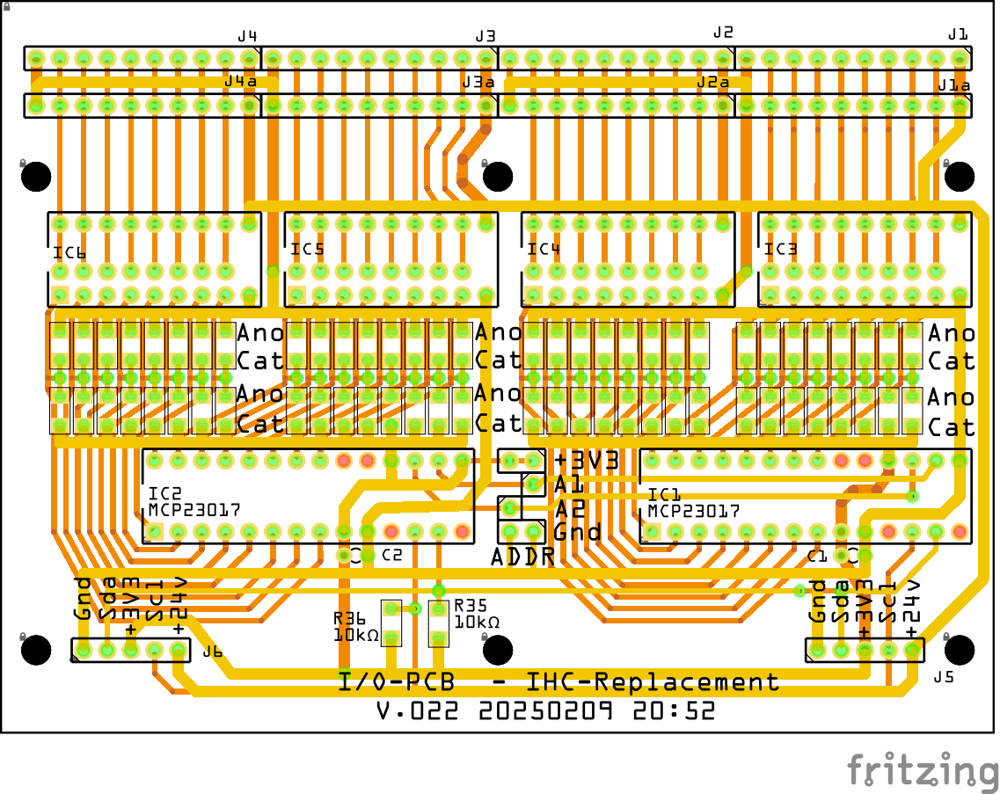
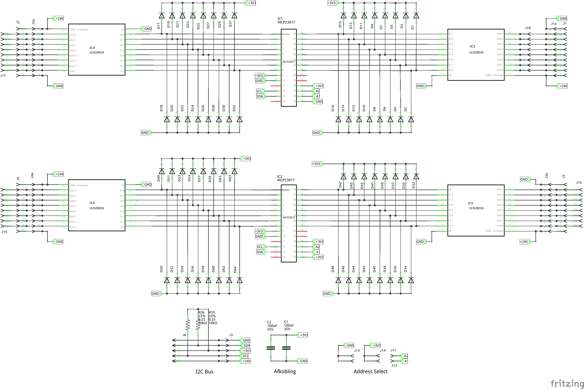
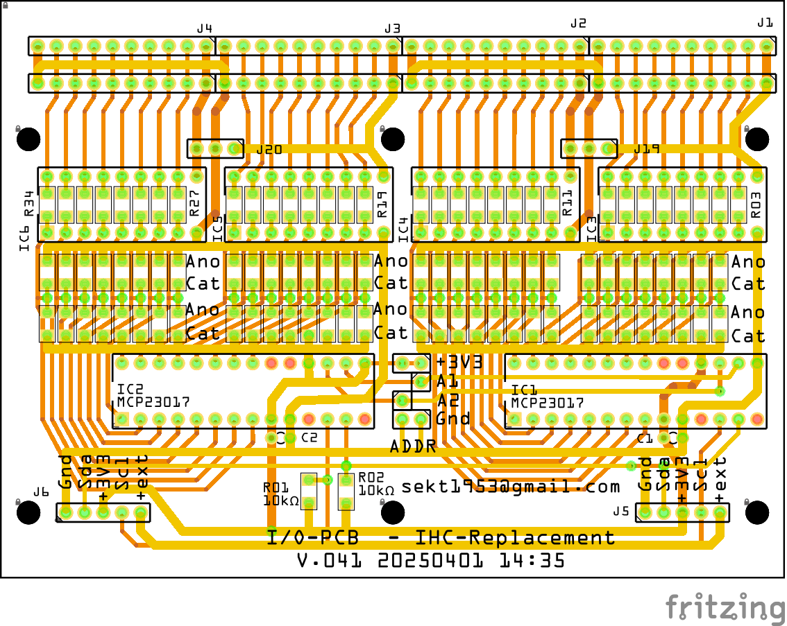
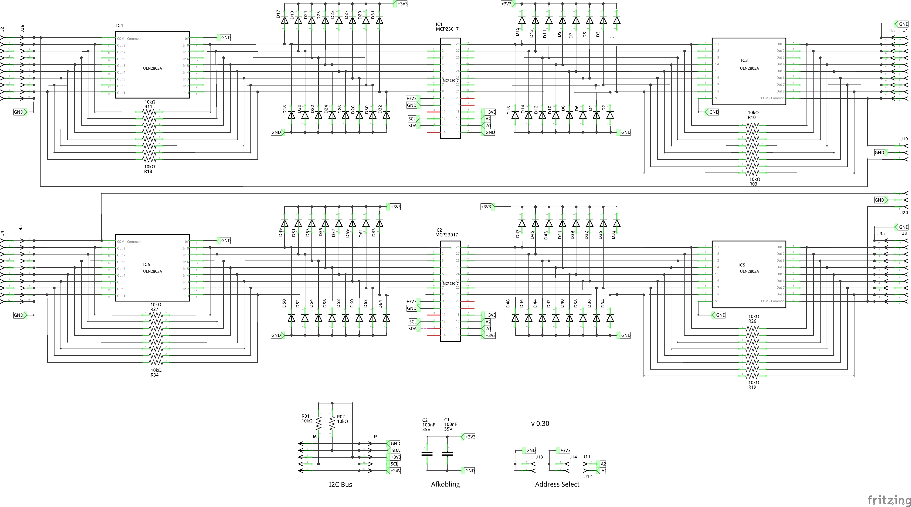
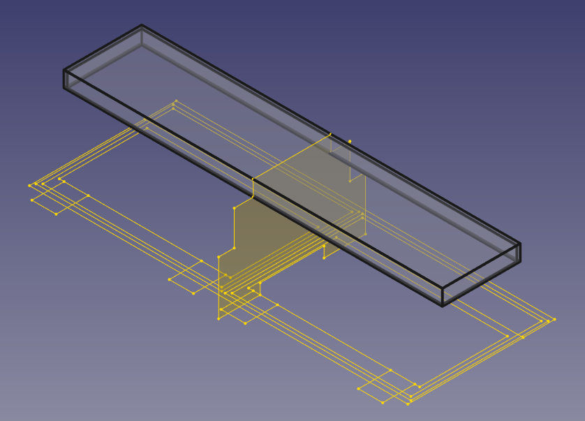
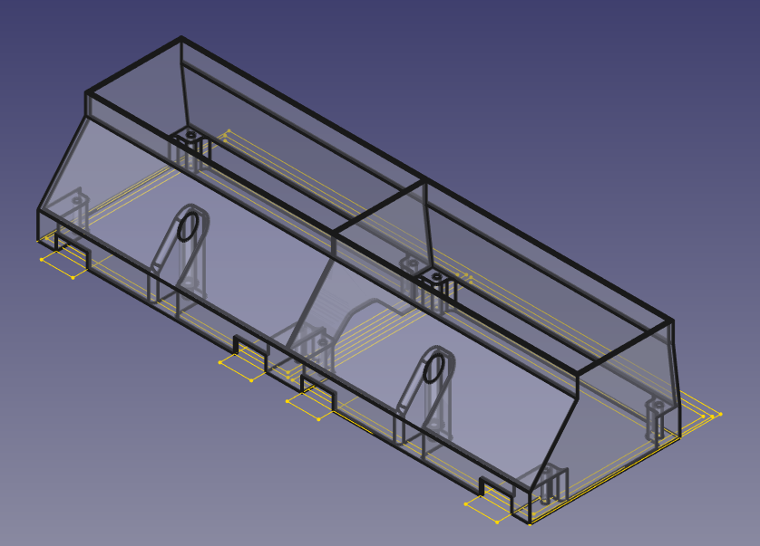
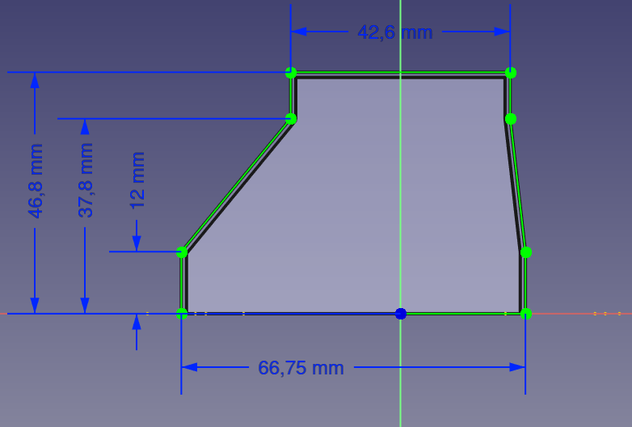
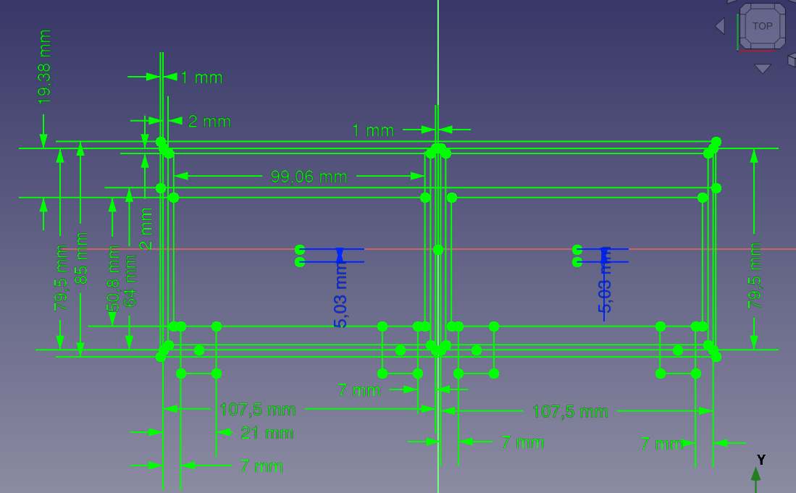
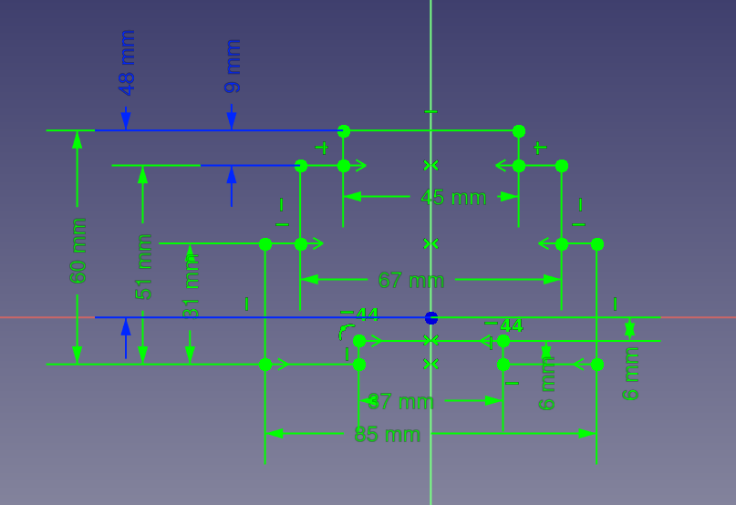

# IHC-Replacement

Her laver jeg en erstatning for mit LK IHC system

Jeg kan ikke længere få reserve dele til mit IHC system som styrer alt lys i huset. 
Jeg har i forevejen et Home Assistant project igang, så nu vil jeg fremstille PCB som kan virke som interface mellem min El installation Og Home Assistant.

## Fritzing

* I/O Ver. 0.22 FritzingFab
  * 
  * 
  * [fzz 0.22](./Fritzing/IO-PCB/FritzingFab_v_0.22/Input_Board_022.fzz)
* I/O Ver. 0.41 
  * 
  * 
  * [Fritzing file version 0.41](./Fritzing/IO-PCB/v_0.4.x/041/Input_Board_041.fzz)

### Bill of Materials

* I/O-PCB IHC-Replacement v.041 20250401 17:51
  * Fælleds for Input og Output config
    * 1 stk PCB, I/O-PCB IHC-Replacement v.040
    * 2 stk MCP20017-E/SP 16-bit
    * 2 stk Ceramic Capacitor 100nF
    * 2 stk 10kΩ Resistor SMD 1206
    * 2 stk 5 pol connector for I2C bus, vinkel MOD 2,54mm
    * 4 stk 10 pol connector for Input / Output, KF141R-10P MOD 2,54mm
    * 2 stk jumper for I2C addr. settings
    * 1 Tube SMD Solder Paste Flux Low Temperature 138°C 30g
  * Matrialer for Input PCB
    * 64 stk 1N4148 SMD 1206
    * 32 stk 10kΩ Resistor SMD 1206
  * Matrialer for Output PCB
    * 4 stk ULN2803A
    * 2 stk 3pol connector for nødbelysning MOD 2,54mm

## FreeCAD

* [DINBox_200 FreeCAD-file](./FreeCAD/DinBox/DinBox_200/DinBox_200.FCStd)
* [DinBox_200_Top
  * 
* DinBox_200_Body
  * 
* DinBox_200_BodyYZ
  * 
* DinBox_200_BaseXY
  * 
* DinBox_200_BaseYZ
  * 
* DINBox_200 3mf-file
  * [DINBox_200 Top 3mf-file](./FreeCAD/DinBox/DinBox_200/DinBox_200-Top.3mf)
  * [DINBox_200 Body 3mf-file](./FreeCAD/DinBox/DinBox_200/DinBox_200-Body002.3mf)

## Home Assistant

* 
  * [Raw configuration Finn's IHC](./HomeAssistant/RawConfigurationFinnsIHC.yaml)

## ESPHome

### YAML-files

* Opsætningen her er for:
  * 48 output for relæer type [Finder](./DataSheet/Finder/Finder.md)
  * 80 input med transient beskyttelse.
* MCU: **OLIMEX ESP32-POE-ISO-16MB**
  * [Manual](./DataSheet/Olimex/ESP32-POE-user-manual.pdf)
  * [Pinout](./DataSheet/Olimex/ESP32-POE-ISO-GPIO.png)
  * **Basic file**
    * [ihc1.yaml](./ESPHome/ihc1.yaml)
  * ESP32 
    * [.olimex-esp32-poe.yaml](./ESPHome/Includes/ESP32/.olimex-esp32-poe.yaml)
  * MCP23017
    * [.mcp23017_ids.yaml](./ESPHome/Includes/MCP23017/.mcp23017_ids.yaml)
    * [.mcp23017_input.yaml](./ESPHome/Includes/MCP23017/.mcp23017_input.yaml)
    * [.mcp23017_output.yaml](./ESPHome/Includes/MCP23017/.mcp23017_output.yaml)
* Home Assistant
  * Automation
    * [LK-PushButton-Pressed](./HomeAssistant/LK-Button/LK-PushBUtton-Pressed.yaml)
      * [Long and short button pressing automation](https://community.home-assistant.io/t/long-and-short-button-pressing-automation/466916/6)
      * Array

Template editor:

```code

* Items:
 * {{item}}


* Items[0]:
* {{my_test_json["items"][0]}}

* Items[1]:
* {{my_test_json["items"][1]}}
```

Result:

```code
* Items:
  * car
  * horse

* Items[0]:
  * car

* Items[1]:
  * horse
```