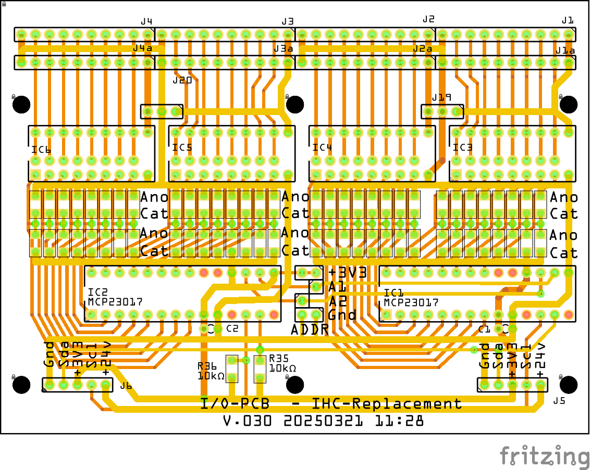
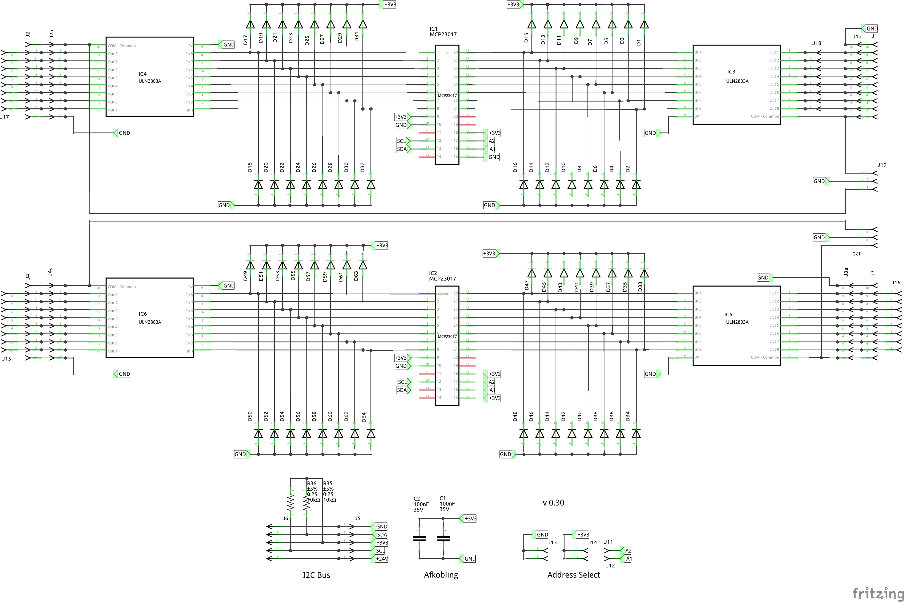

# IHC-Replacement

Her laver jeg en erstatning for mit LK IHC system

Jeg kan ikke længere få reserve dele til mit IHC system som styrer alt lys i huset. 
Jeg har i forevejen et Home Assistant project igang, så nu vil jeg fremstille PCB som kan virke som interface mellem min El installation Og Home Assistant.

## Fritzing

* I/O Ver. 0.22 FritzingFab
  * 
  * 
  * [fzz 0.22](./Fritzing/IO-PCB/FritzingFab_v_0.22/Input_Board_022.fzz)
* I/O Ver. 0.30
  * 
  * 
  * [Fritzing file version 0.30](./Fritzing/IO-PCB/v_0.30/Input_Board_030.fzz)

## FreeCAD

* [DINBox ](./FreeCAD/DINBox_002.FCStd)
  * 
* [TrykHolder](./FreeCAD/TrykHolder/Trykholder_v4.FCStd)
  * 
  * 
  * [FreeCAD File for TrykHolder](./FreeCAD/TrykHolder/Trykholder_v4.FCStd)