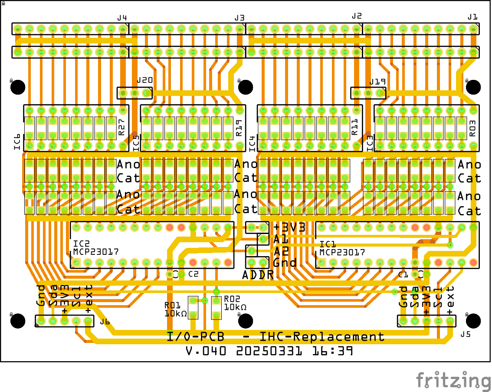

# IHC-Replacement

Her laver jeg en erstatning for mit LK IHC system

Jeg kan ikke længere få reserve dele til mit IHC system som styrer alt lys i huset. 
Jeg har i forevejen et Home Assistant project igang, så nu vil jeg fremstille PCB som kan virke som interface mellem min El installation Og Home Assistant.

## Fritzing

* I/O Ver. 0.22 FritzingFab
  * 
  * 
  * [fzz 0.22](./Fritzing/IO-PCB/FritzingFab_v_0.22/Input_Board_022.fzz)
* I/O Ver. 0.40 
  * 
  * 
  * [Fritzing file version 0.40](./Fritzing/IO-PCB/v_0.4.0/Input_Board_040.fzz)

### Bill of Materials

* I/O-PCB IHC-Replacement v.040 20250331 16:39
  * Fælleds for Input og Output config
    * 1 stk PCB, I/O-PCB IHC-Replacement v.040
    * 2 stk MCP20017-E/SP 16-bit
    * 2 stk Ceramic Capacitor 100nF
    * 2 stk 10kΩ Resistor SMD 1206
    * 2 stk 5 pol connector for I2C bus, vinkel MOD 2,54mm
    * 4 stk 10 pol connector for Input / Output, KF141R-10P MOD 2,54mm
    * 2 stk jumper for I2C addr. settings
    * 1 Tube SMD Solder Paste Flux Low Temperature 138°C 30g
  * Matrialer for Input PCB
    * 64 stk 1N4148 SMD 1206
    * 32 stk 10kΩ Resistor SMD 1206
  * Matrialer for Output PCB
    * 4 stk ULN2803A
    * 2 stk 3pol connector for nødbelysning MOD 2,54mm

## FreeCAD

* [DINBox ](./FreeCAD/DINBox_002.FCStd)
  * 
* [TrykHolder](./FreeCAD/TrykHolder/Trykholder_v4.FCStd)
  * 
  * 
  * [FreeCAD File for TrykHolder](./FreeCAD/TrykHolder/Trykholder_v4.FCStd)

## Home Assistant

* 
  * [Raw configuration Finn's IHC](./HomeAssistant/RawConfigurationFinnsIHC.yaml)

### Developer tools

* Kilde:
  * [Extract a nested array value in JSON](https://community.home-assistant.io/t/solved-extract-a-nested-array-value-in-json/173906/2)

#### Template editor

```yaml
"meta" : [ { 
    "publisher" : "Environment Agency" ,
    "licence" : "http://www.nationalarchives.gov.uk/doc/open-government-licence/version/3/" ,
    "documentation" : "http://environment.data.gov.uk/flood-monitoring/doc/reference" ,
    "version" : "0.9" ,
    "comment" : "Status: Beta service" ,
    "hasFormat" : [ { "csv" : "http://environment.data.gov.uk/flood-monitoring/id/stations/2077/readings.csv?latest", "rdf" : "http://environment.data.gov.uk/flood-monitoring/id/stations/2077/readings.rdf?latest" } ]
  } ],
  "items" : [ { 
    "@id" : "http://environment.data.gov.uk/flood-monitoring/data/readings/2077-level-stage-i-15_min-mASD/2020-02-23T11-00-00Z" ,
    "dateTime" : "2020-02-23T11:00:00Z" ,
    "measure" : "http://environment.data.gov.uk/flood-monitoring/id/measures/2077-level-stage-i-15_min-mASD" ,
    "value" : 3.518
  }
   ]
} %}
meta:
{{ value_json['meta'][0].publisher }}
{{ value_json['meta'][0].licence }}
{{ value_json['meta'][0].documentation }}
{{ value_json['meta'][0].version }}
{{ value_json['meta'][0].comment }}
{{ value_json['meta'][0].hasFormat[0].csv }}
{{ value_json['meta'][0].hasFormat[0].rdf }}

Items:
{{ value_json['items'][0].id }}
{{ value_json['items'][0].dateTime }}
{{ value_json['items'][0].measure }}
{{ value_json['items'][0].value }}
```

#### Result

```yaml
meta:
Environment Agency
http://www.nationalarchives.gov.uk/doc/open-government-licence/version/3/
http://environment.data.gov.uk/flood-monitoring/doc/reference
0.9
Status: Beta service
http://environment.data.gov.uk/flood-monitoring/id/stations/2077/readings.csv?latest
http://environment.data.gov.uk/flood-monitoring/id/stations/2077/readings.rdf?latest

Items:
http://environment.data.gov.uk/flood-monitoring/data/readings/2077-level-stage-i-15_min-mASD/2020-02-23T11-00-00Z
2020-02-23T11:00:00Z
http://environment.data.gov.uk/flood-monitoring/id/measures/2077-level-stage-i-15_min-mASD
3.518
```


## ESPHome

* [ihc1.yaml](./ESPHome/ihc1.yaml)
* Include files
  * Olimex ESP32-POE-ISO-16MB
    * [.olimex-esp32-poe.yaml](./ESPHome/Includes/ESP32/.olimex-esp32-poe.yaml)
  * MCP23017
    * [.mcp23017_ids.yaml](./ESPHome/Includes/MCP23017/.mcp23017_ids.yaml)
    * [.mcp23017_input.yaml](./ESPHome/Includes/MCP23017/.mcp23017_input.yaml)
    * [.mcp23017_output.yaml](./ESPHome/Includes/MCP23017/.mcp23017_output.yaml)
